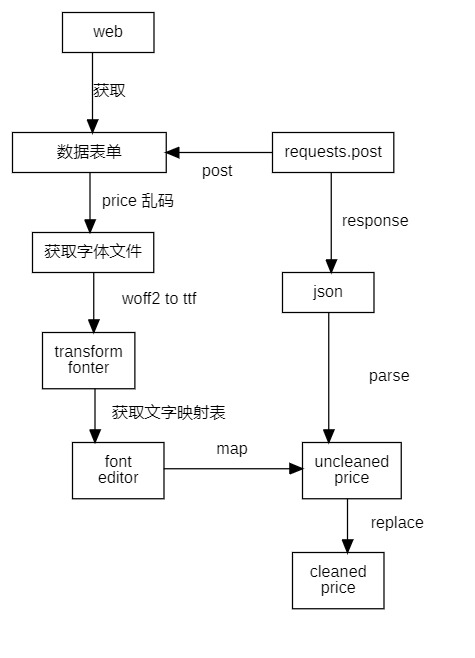

# README

## reference

[参考视频](https://www.bilibili.com/video/BV1RD421g7kL/?spm_id_from=333.337.search-card.all.click&vd_source=62be63bb97ad70a5484a980989eb1de5)

[参考博客1](https://cloud.tencent.com/developer/article/1831685)

[参考博客2](https://www.cnblogs.com/feng0815/p/16656656.html)

## keyword

- 字体反爬
- requests
- fonttools

## href

[dongchedi_used_cars](https://www.dongchedi.com/usedcar/x-x-x-x-x-x-x-x-x-x-x-x-x-x-x-x-x-x-x-x-x-1-1-x-x-x-x-x)

## tools

[百度编辑器](https://kekee000.github.io/fonteditor/#)

[transfonter](https://transfonter.org/)

## flow chart diagram

## warning

without car mileage causes same parameters but different sh_price and you can drop them but the first row retained

pip install -i https://pypi.tuna.tsinghua.edu.cn/simple paddlepaddle
pip install -i https://pypi.tuna.tsinghua.edu.cn/simple shapely
pip install -i https://pypi.tuna.tsinghua.edu.cn/simple paddleocr
